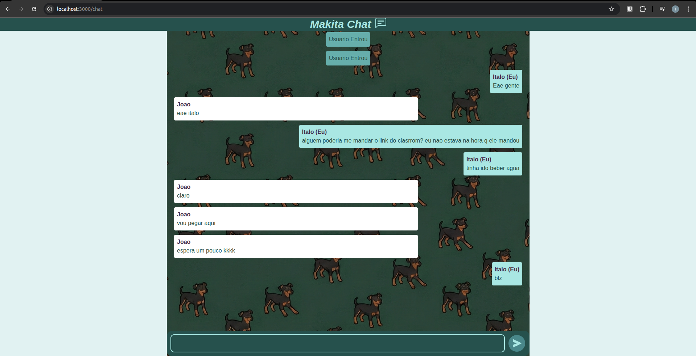

# 🛠️ MKT Chat (Makita Chat)

O **MKT Chat** é uma aplicação de chat em tempo real desenvolvida como uma homenagem especial à **Makita**, a cadelinha que viveu no **IFCE - Campus Aracati** e que todos nós alunos de lá amávamos. 

A "Makita" não era apenas uma mascote, ela era um símbolo de carinho e companhia para todos os alunos, professores e funcionários do campus. Infelizmente, ela nos deixou em Julho de 2025. Este projeto carrega seu nome como uma forma de imortalizar a memória dessa grande amiga da comunidade acadêmica. 🐾

---



## 🚀 Funcionalidades

* **Comunicação Instantânea**: Troca de mensagens em tempo real utilizando WebSockets.
* **Gestão de Sessão Local**: Uso de React Context para manter o nome do usuário durante a navegação entre as rotas.
* **Interface Moderna**: UI desenvolvida com Tailwind CSS v4, focada em usabilidade e feedback visual.
* **Scroll Inteligente**: A área de chat desce automaticamente para a mensagem mais recente.

---

## 🛠️ Stacks Técnicas

A aplicação utiliza uma arquitetura separada entre **Client** e **Server**, garantindo escalabilidade e separação de responsabilidades.

### **Frontend (Client)**
* **Next.js (App Router)**: Framework principal para renderização e gerenciamento de rotas.
* **Tailwind CSS v4**: Estilização de alta performance com uso intensivo de variáveis de tema.
* **React Context API**: Gerenciamento de estado global para o `userName` e controle de conexão.
* **React Icons**: Ícones das bibliotecas `bs` (Bootstrap Icons) e `bi` (BoxIcons).

### **Backend (Server)**
* **NestJS**: Framework Node.js para a construção do servidor de WebSocket robusto.
* **Socket.io**: Motor para comunicação bidirecional de baixa latência.
* **TypeScript**: Tipagem estática em 100% do fluxo de dados para maior segurança.

### **Infraestrutura**
* **Docker & Docker Compose**: Orquestração de containers para facilitar o deploy e o ambiente de desenvolvimento.

---

## 📦 Como Rodar o Projeto

Você precisará ter apenas o **Docker** e o **Docker Compose** instalados.

1.  **Clone o repositório:**
    ```bash
    git clone [https://github.com/seu-usuario/mkt-chat.git](https://github.com/seu-usuario/mkt-chat.git)
    cd mkt-chat
    ```

2.  **Suba os serviços:**
    ```bash
    docker compose up --build
    ```

3.  **Acesse no seu navegador:**
    * **Aplicação (Frontend)**: [http://localhost:3000](http://localhost:3000)
    * **Servidor (Backend/Socket)**: [http://localhost:3001](http://localhost:3001)

---

## 📁 Estrutura do Repositório

```text
mkt-chat/
├── client/           # Projeto Next.js (Interface do usuário)
├── server/           # Projeto NestJS (Lógica do chat e WebSocket)
├── docker-compose.yml # Arquivo de orquestração dos containers
└── README.md         # Documentação do sistema
```

# "Para alguns, apenas uma cadelinha. Para o IFCE, um ícone. Descanse em paz, Makita." 🐕✨